# so-exam3

**Universidad Icesi**  
**Curso:** Sistemas Operativos  
**Estudiante:** edisson guerrero londoño    
**Codigo:**  A00328068  
**Correo:**  edixon_guerrero96@hotmail.com  
**Repositorio:**  https://github.com/ediguerrero/so-exam3.git

### punto 3:

se hacen dos archivos llamados requirements.txt y requirements_dev.txt dentro del repositorio para implementar el servicio web Flask.  

- Se crea un programa en python la cual contiene los metodos para saber el consumo de CPU, la memoria disponible y
el espacio en disco libre.   

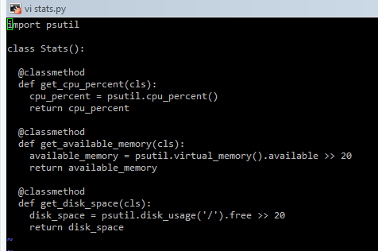

Se crea un archivo app.py con el cual se presta el servicio web flask 

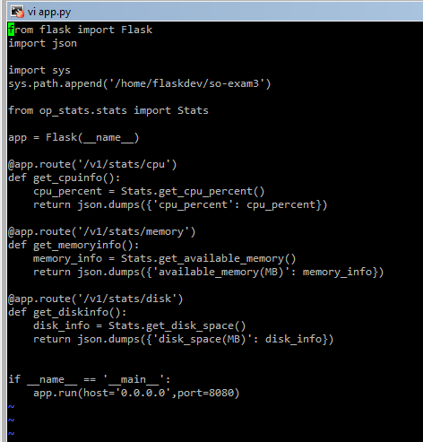

 Se ejecuta el servicio  

 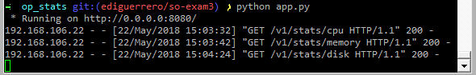
 
 
  
 Se realizan peticiones usando la aplicación **Postman:**
 
 ## Servicio cpu_info : muestra el porcentaje de consumo de CPU
 
   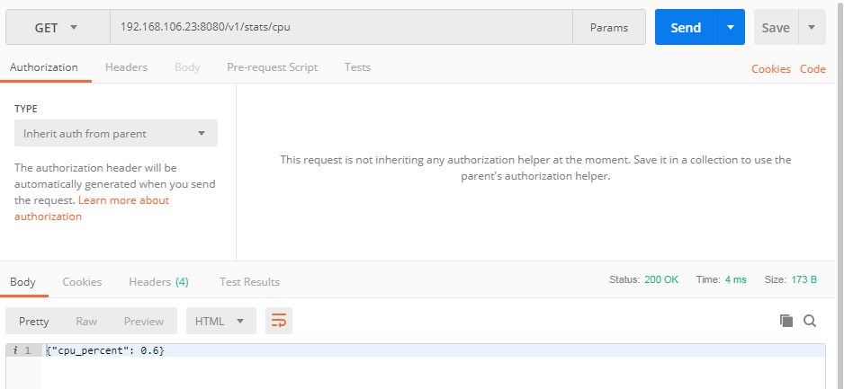 

## Servicio available_memory: muestra la cantidad de memoria ram disponible en MB

  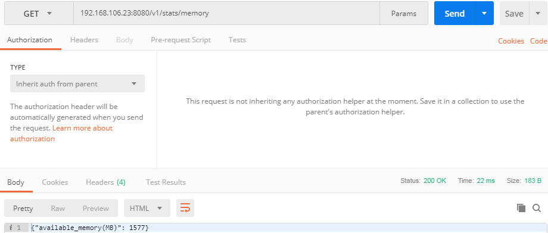 
  
## Servicio disk_space: Muestra la cantidad de espacio del disco disponible en MB

  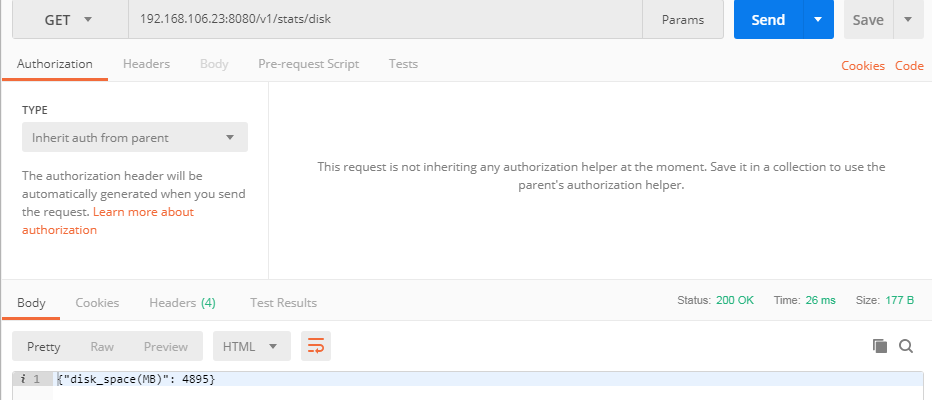 
  
  
## punto 4:

para probar el servicio se crea un archivo llamado test_stats.py

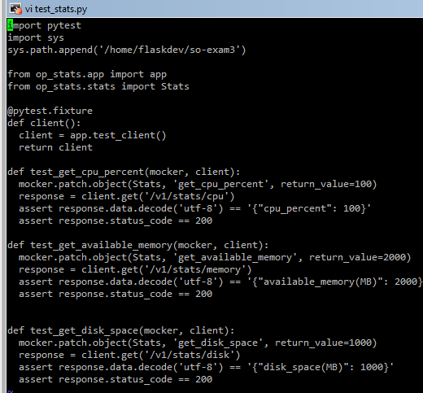 

Se ejecutan las pruebas usando el comando de py.test -v

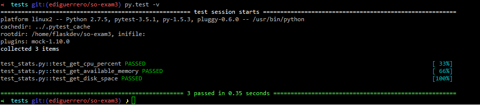 

## Punto 5:

para la integración continua se crea un archivo tox.ini en el cual se especifica, la libreria pra pruebas
el lenguaje base, el cual es python3 y por ultimo se especifica las dependencias que se van a usar
y el comando para realizar las pruebas: 

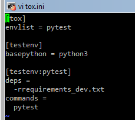 

se ejecutan las pruebas:  

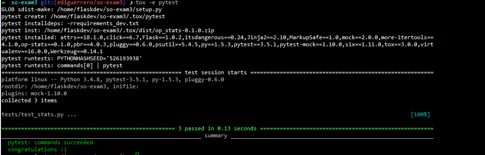

Por ultimo crea un archivo **.travis.yml**, es cual guarda la configuracion basica para correr las 
pruebas realizadas por travis-ci.org, aqui se especifica el lenguaje , si se quieren recibir notificaciones por correo, version de
python y las dependencias

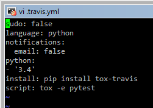

por ultimo vemos las pruebas pasar sin problemas

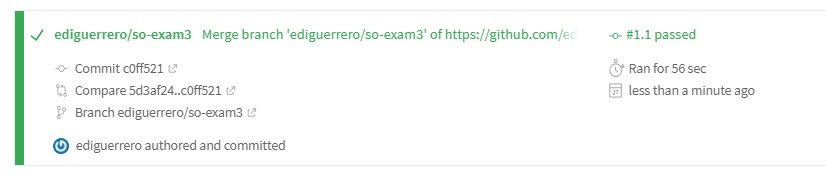

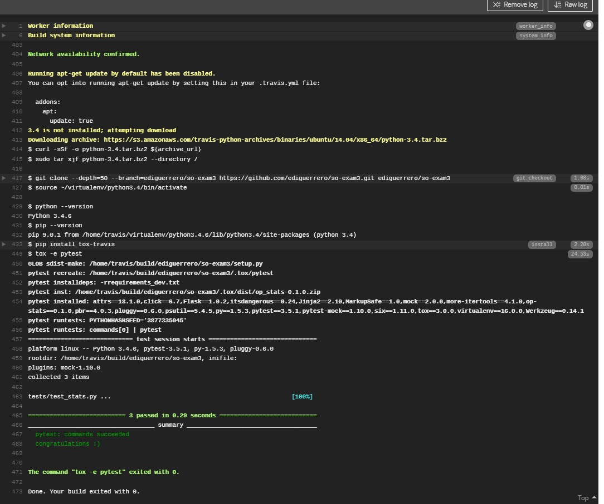

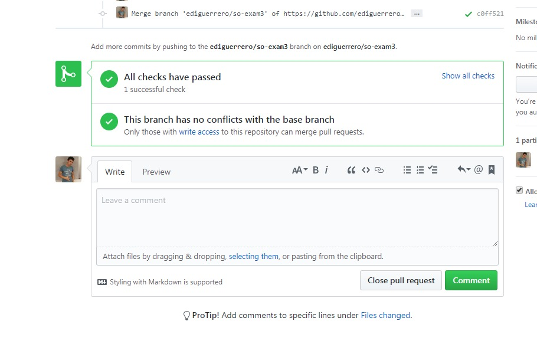

